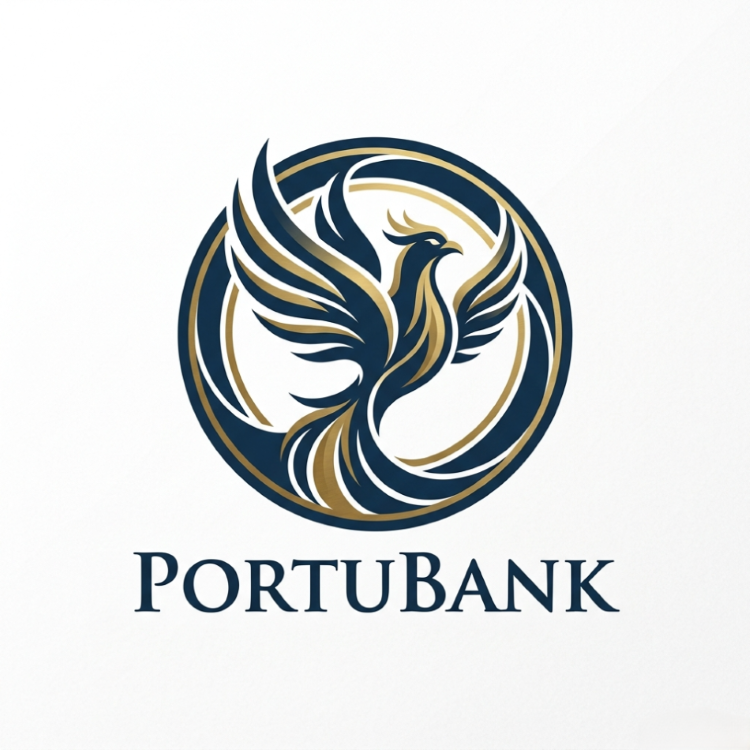

# Propensity_to_Subscribe_Prediction_AlphaGroup

<h1 align="center">📞 Optimasi Telemarketing Perbankan</h1>
<h3 align="center">Model Prediktif Minat Nasabah Terhadap Deposito Berjangka Berbasis Minimalisasi Biaya Loss</h3>

  

  
  
  
  
  
  
  
  

  <a href="https://termdepositpredictor-alpha.streamlit.app/"><b>🚀 Live Demo (Streamlit)</b></a> •
  <a href="https://public.tableau.com/app/profile/muhammad.hafizh.hariyanto/viz/BankTelemarketingProfileofCostumersLikelytoSubscribetoTermDeposit/Dashboard2"><b>📊 Tableau Dashboard</b></a> •
  <a href="https://www.kaggle.com/datasets/volodymyrgavrysh/bank-marketing-campaigns-dataset/data"><b>📂 Dataset</b></a>

---

## Tim Penulis

| Nama | LinkedIn |
|---|---|
| **Muhammad Hafizh Hariyanto** | [LinkedIn Profile](https://www.linkedin.com/in/muhammad-hafizh-hariyanto/) |
| **Baira Rahayu** | [LinkedIn Profile](https://www.linkedin.com/in/baira-rahayu/) |

---

## Ringkasan Proyek

**PortuBank** adalah institusi perbankan ritel Portugal yang mengandalkan strategi **telemarketing langsung** untuk mengakuisisi dana pihak ketiga melalui produk **Term Deposit** (Deposito Berjangka). Berdasarkan dataset historis kampanye 2008–2013, hanya **11,3%** dari total nasabah yang dihubungi akhirnya *subscribe* — artinya **hampir 9 dari setiap 10 panggilan berakhir tanpa konversi**.

Proyek ini membangun model prediktif **propensity-to-subscribe** yang menjawab problem bisnis langsung: **meminimalkan biaya kehilangan nasabah berminat (False Negative)**, di mana setiap FN bernilai **€37,50** (revenue NIM tahunan yang lepas) — sekitar **34× lebih besar** dari biaya satu panggilan tidak produktif (FP = **€1,09**).

> **Insight Kunci:** Bobot kerugian FN yang 34× lipat dibanding FP menjadi dasar pemilihan **F6-Score** sebagai metrik utama (β=6 → bobot Recall ≈ 36× Precision) dan **threshold tuning** untuk meminimalkan total biaya loss.

---

## Problem Statement

> *"Bagaimana membangun model klasifikasi propensity-to-subscribe yang **meminimalkan biaya kehilangan nasabah berminat (False Negative)** — di mana setiap FN bernilai €37,50, sekitar **34× lebih besar** dari biaya satu panggilan tidak produktif (False Positive €1,09) — sehingga total biaya loss kampanye telemarketing serendah mungkin?"*

### Struktur Biaya Loss

| Komponen | Nilai | Asumsi |
|---|---|---|
| **False Negative (FN)** | **€37,50** | Revenue NIM tahunan yang lepas (€2.500 deposito × 1,5% NIM) |
| **False Positive (FP)** | **€1,09** | Biaya 1 panggilan tidak produktif (telefoni + SDM) |
| **Rasio FN : FP** | **34,4 : 1** | Justifikasi pemakaian F6-Score (β=6) |

---
